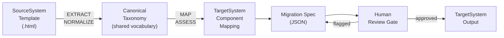
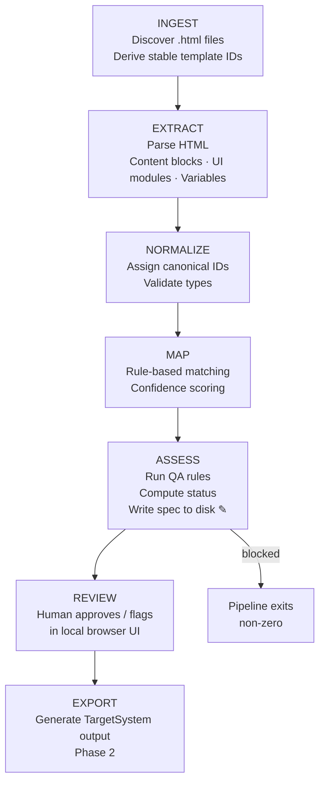
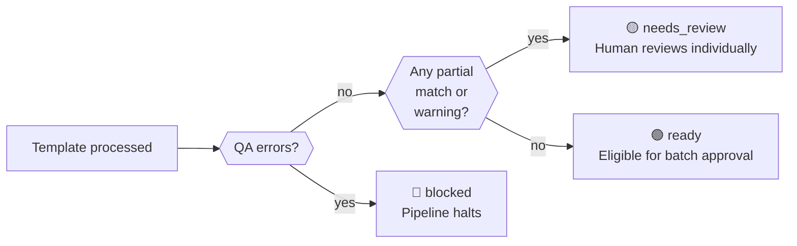

# Email Migrator — Stakeholder Presentation Materials

> Phase 1 complete. These materials are designed to be turned into slides or shared directly.
> All system and brand names use neutral placeholders: SourceSystem, TargetSystem, SourceBrand, TargetBrand.

---

## Executive Summary

We built a tool that migrates email templates from SourceSystem to TargetSystem systematically, safely, and at scale. Instead of manually rewriting each template, the tool reads each source template, classifies every content and layout element against a shared taxonomy, maps those elements to their TargetSystem equivalents, and produces a structured migration spec. No target output is generated until a human reviewer has approved the spec.

Phase 1 is complete: the full pipeline runs, produces reviewed-ready migration specs for any number of HTML templates, and includes a local browser-based review UI. 57 automated tests pass.

---

## Slide Outline (10 slides)

| # | Title |
|---|-------|
| 1 | Email Template Migration — Phase 1 Complete |
| 2 | The Problem |
| 3 | Our Approach: A Translation Layer |
| 4 | The Canonical Taxonomy |
| 5 | How the Pipeline Works |
| 6 | Human Review is Mandatory |
| 7 | What We Built in Phase 1 |
| 8 | Live Demo |
| 9 | Why This Matters |
| 10 | Limitations & Next Steps |

---

## Slide Content

### Slide 1 — Email Template Migration: Phase 1 Complete

- Migration tool for translating SourceBrand email templates to TargetBrand
- Canonical taxonomy-first approach: no direct template-to-template copying
- Phase 1 pipeline is complete and tested
- Human approval required before any target output is produced

---

### Slide 2 — The Problem

**We have hundreds of email templates. Manual migration is risky.**

- Templates contain personalisation variables, compliance disclaimers, legal language
- Manual copy-paste misses variables, breaks links, and loses context
- Different people migrating different templates produce inconsistent results
- No audit trail: how do you know what was changed and why?
- Scale: hundreds of templates × multiple reviewers = months of error-prone work

**The cost of getting this wrong is high.** A broken transactional email or missing disclaimer is a customer experience failure, or worse.

---

### Slide 3 — Our Approach: A Translation Layer

**We don't copy templates. We translate them through a shared language.**

```
SourceSystem template
        ↓
  Canonical Taxonomy   ← shared vocabulary, defined once
        ↓
TargetSystem mapping
        ↓
  Human review gate
        ↓
TargetSystem output
```

- Every element in every source template is classified against the canonical taxonomy
- The taxonomy is the contract between the two systems
- Mappings are rule-based, deterministic, and auditable
- No output is produced without human sign-off

This is safer than a migration script and faster than manual rewriting.

---

### Slide 4 — The Canonical Taxonomy

**A shared vocabulary for everything in an email template.**

Two layers:

| Layer | What it classifies | Examples |
|-------|-------------------|---------|
| Content blocks | What the text *is* | headline, preheader, body text, CTA, disclaimer, footer |
| UI modules | How it's *laid out* | header, hero, text block, button, divider, footer |

Every block and module gets:
- A **stable ID**: `payment-reminder:headline:0`
- A **type**: one of the canonical vocabulary values
- **Variables** extracted: `{{firstName}}`, `{{amount}}`, `{{dueDate}}`
- A **mapping result**: which TargetSystem component it maps to, with a confidence score

This structure makes every migration decision inspectable and auditable.

---

### Slide 5 — How the Pipeline Works

```
INGEST       Read HTML files from source directory
    ↓
EXTRACT      Parse each template: content blocks, UI modules, variables
    ↓
NORMALIZE    Assign stable IDs, validate structure, classify types
    ↓
MAP          Match each component to a TargetSystem equivalent
    ↓
ASSESS       Run QA rules, score confidence, compute status, write spec to disk
    ↓
REVIEW       Human reviewer approves or flags each spec in a local UI
    ↓
EXPORT       Generate TargetSystem output (Phase 2)
```

- Stages 1–5 run automatically from a single CLI command
- Nothing is written to disk until ASSESS
- REVIEW requires human action before EXPORT can proceed
- EXPORT is hard-gated: it only runs after full approval

---

### Slide 6 — Human Review is Mandatory

**The system will not generate target output without a human approving the migration spec.**

Each template ends up in one of three states after the pipeline runs:

| Status | Meaning | What happens |
|--------|---------|-------------|
| `ready` | All components mapped at 100% confidence, no QA issues | Available for batch approval in review UI |
| `needs_review` | One or more components mapped at < 100% confidence, or QA warnings | Must be reviewed individually |
| `blocked` | QA errors (e.g. empty template, missing compliance) | Pipeline exits with a non-zero code. Cannot proceed. |

The review UI shows the full migration spec, the source template side-by-side, and lets reviewers approve or flag with a note. Batch approval is available for `ready` templates.

---

### Slide 7 — What We Built in Phase 1

**A complete, tested, runnable pipeline.**

| Component | What it does |
|-----------|-------------|
| HTML extractor | Parses SourceSystem templates into structured content and layout blocks |
| Normalizer | Assigns stable canonical IDs and validates the structure |
| Rule-based mapper | Maps every component to its TargetSystem equivalent |
| QA engine | Checks variable consistency, compliance markers, structural integrity |
| ASSESS stage | Runs mapper + QA, computes status, writes migration spec JSON |
| Review server | Local Express app serving the review UI |
| Review UI | Vanilla JS single-page app: approve, flag, batch-approve |
| CLI | `migrator run`, `migrator review`, `migrator export` (Phase 2) |

**57 automated tests. Zero manual configuration required to run.**

---

### Slide 8 — Live Demo

*See the demo guide for the full script.*

**What we'll show:**

1. A source HTML email template (payment reminder)
2. Run `migrator run --source ./demo/fixtures --specs ./demo/specs`
3. Open the review UI: `migrator review --specs ./demo/specs --source ./demo/fixtures`
4. Walk through one migration spec: content blocks, variables, mapping results
5. Approve and flag
6. Show the `blocked` path (conceptually)

**Key things to notice:**
- Variables like `{{firstName}}`, `{{amount}}` are automatically extracted
- Every mapping has a reason and a confidence score
- The reviewer sees the source template side-by-side
- Nothing proceeds without the reviewer's action

---

### Slide 9 — Why This Matters

**Consistency.** Every template goes through the same classification and mapping process. No drift between what different team members did.

**Traceability.** Every migration decision is recorded in a structured spec JSON. You can audit exactly what was mapped, why, and what the confidence was.

**Speed.** A single `migrator run` processes a batch of templates in seconds. Human review time is focused on genuinely ambiguous cases, not routine mapping.

**Safety.** Blocked templates halt the pipeline with clear error messages. Compliance issues are caught automatically. Nothing reaches TargetSystem without sign-off.

**Reversibility.** The migration spec is the source of truth. If TargetSystem structure changes, you update the mapper rules and re-run — without touching the source templates or the review history.

---

### Slide 10 — Limitations & Next Steps

**What Phase 1 does not do yet:**

| Limitation | Notes |
|-----------|-------|
| Export to TargetSystem | Needs TargetSystem template structure confirmed |
| AI-assisted classification | Stub only; GitHub Copilot is the candidate for Phase 2 |
| Style/token migration | Design tokens, colours, typography not yet extracted |
| Multi-column layout | Complex layout patterns deferred to Phase 2 |
| Image asset handling | Images are detected but not transferred |
| Hosted review UI | Currently local only; no multi-user or async review |

**Phase 2 triggers:**
- TargetSystem template API / structure is confirmed
- Real template batch is ready for processing
- Stakeholder sign-off on canonical taxonomy completeness

---

## Architecture Diagrams (Mermaid)

### Diagram 1 — The Translation Approach



---

### Diagram 2 — Pipeline Stages



---

### Diagram 3 — Template Status After ASSESS



---

## Before / During / After Demo Story

### Before

> "We have a payment reminder email in SourceSystem. It has a headline, body text with personalisation variables, a CTA button, a disclaimer, and a footer. To migrate it manually, someone would need to open the source HTML, identify each component, find the right TargetSystem module, copy the content, check for missed variables, and do the same for 200 more templates."

### During

> "Instead, we run one command. The system reads the HTML, classifies every element, extracts all variables automatically, maps each one to its TargetSystem equivalent, scores confidence, and produces a structured migration spec. The whole process takes about a second per template."

> "Then we open the review UI. The reviewer sees the source template on one side and the migration spec on the other. They can approve it, flag it with a note, or batch-approve all templates that scored 100% confidence. Nothing moves to TargetSystem until this step."

### After

> "We have a reviewed, auditable migration spec for every template. When the TargetSystem export adapter is built in Phase 2, it reads these specs and generates the target output — consistently, without anyone having to manually re-map components they already reviewed."

---

## Demo Script (live, ~5 minutes)

**Setup:** Terminal + browser open. Source templates in `demo/fixtures/`.

---

**[0:00 — 0:30] Set the scene**

> "We have a payment reminder email in SourceSystem. Let me show you what the migration looks like."

Open `demo/fixtures/payment-reminder.html` in a browser or text editor.

> "It has a preheader, a headline, body text with variables like `{{firstName}}` and `{{amount}}`, a CTA button, a disclaimer, and a footer."

---

**[0:30 — 1:15] Run the pipeline**

```bash
npx tsx src/cli/index.ts run --source ./demo/fixtures --specs ./demo/specs
```

> "One command. INGEST finds the file. EXTRACT parses it. NORMALIZE assigns stable IDs. MAP matches each component to its TargetSystem equivalent. ASSESS runs QA rules and writes the spec to disk."

Show terminal output:
```
Starting migration pipeline
[ingest] Found 1 template(s)
[extract] payment-reminder.html
[normalize] payment-reminder.html
[map] Running component mapping...
[assess] Running QA and mapping...

--- Pipeline complete ---
Total:        1
Ready:        0
Needs review: 1
Blocked:      0
```

> "One template. Zero blocked. It needs review because the CTA button confidence is 0.7 — the mapper correctly flagged that the button variant needs human confirmation."

---

**[1:15 — 2:30] Open the review UI**

```bash
npx tsx src/cli/index.ts review --specs ./demo/specs --source ./demo/fixtures
```

Open `http://localhost:3000` in browser.

> "This is the review UI. On the left, the template list with status badges. Click on payment-reminder."

Show the spec detail:
- **Content blocks:** preheader, headline, body text, CTA, disclaimer, footer content
- **Variables:** `{{firstName}}`, `{{amount}}`, `{{dueDate}}`, `{{payUrl}}`, `{{unsubscribeUrl}}`, `{{privacyUrl}}`
- **Mapping results:** show the CTA row with `partial` match, confidence 0.7

> "Every content block has a canonical ID, a type, its text, and all variables. Every mapping shows which TargetSystem component it maps to, the confidence, and the reason."

> "The CTA button is flagged as partial — the mapper says 'button variant requires manual confirmation'. This is intentional: the system knows what it doesn't know."

---

**[2:30 — 3:30] Approve**

Click **Approve** on the payment-reminder template.

> "Reviewer approves. The spec is updated, review status is set to approved. This is the gate before Phase 2 export."

Show the updated status in the sidebar.

---

**[3:30 — 4:30] Show the spec JSON (optional)**

```bash
cat demo/specs/payment-reminder.json
```

> "Here's what lives on disk after ASSESS. Stable IDs, canonical types, all variables extracted, mapping results with confidence scores, QA notes, status, timestamp. This is the source of truth for export."

---

**[4:30 — 5:00] Close**

> "This is Phase 1 complete. The pipeline reads source templates, classifies and maps every component, enforces human review, and produces auditable migration specs at scale. Phase 2 connects this to TargetSystem output."

---

## Example Translation Walkthrough

### Source: payment-reminder.html

```html
<div class="preheader">Your payment of {{amount}} is due on {{dueDate}}</div>
<h1>Payment reminder, {{firstName}}</h1>
<p>Your payment of {{amount}} is due on {{dueDate}}. Log in to pay before the due date.</p>
<a href="{{payUrl}}" class="button">Make a payment</a>
<p class="disclaimer">Subject to terms and conditions.</p>
<p class="footer-content">© 2026 SourceBrand.
  <a href="{{unsubscribeUrl}}">Unsubscribe</a> | <a href="{{privacyUrl}}">Privacy Policy</a>
</p>
```

---

### Step 1: EXTRACT — canonical content blocks

| ID | Type | Text | Variables |
|----|------|------|-----------|
| `payment-reminder:preheader:0` | preheader | Your payment of {{amount}} is due on {{dueDate}} | `{{amount}}`, `{{dueDate}}` |
| `payment-reminder:headline:0` | headline | Payment reminder, {{firstName}} | `{{firstName}}` |
| `payment-reminder:body_text:0` | body_text | Your payment of {{amount}} is due... | `{{amount}}`, `{{dueDate}}` |
| `payment-reminder:cta:0` | cta | Make a payment | `{{payUrl}}` |
| `payment-reminder:disclaimer:0` | disclaimer | Subject to terms and conditions. | _(none)_ |
| `payment-reminder:footer_content:0` | footer_content | © 2026 SourceBrand. | `{{unsubscribeUrl}}`, `{{privacyUrl}}` |

Template-level variables (deduplicated): `{{amount}}`, `{{dueDate}}`, `{{firstName}}`, `{{payUrl}}`, `{{unsubscribeUrl}}`, `{{privacyUrl}}`

---

### Step 2: MAP — TargetSystem component mapping

| Component ID | Match type | Confidence | Target module | Reason |
|-------------|-----------|-----------|--------------|--------|
| `payment-reminder:preheader:0` | exact | 1.0 | TargetSystem/Preheader | Preheader maps directly by type. |
| `payment-reminder:headline:0` | exact | 1.0 | TargetSystem/Headline | Headline maps directly by type. |
| `payment-reminder:body_text:0` | exact | 1.0 | TargetSystem/BodyText | Body text maps directly by type. |
| `payment-reminder:cta:0` | **partial** | **0.8** | TargetSystem/CTA | CTA content mapped; button variant requires manual confirmation. |
| `payment-reminder:disclaimer:0` | exact | 1.0 | TargetSystem/Disclaimer | Disclaimer maps directly by type. |
| `payment-reminder:footer_content:0` | exact | 1.0 | TargetSystem/FooterContent | Footer content maps directly by type. |
| `payment-reminder:text_block:0` _(UI module)_ | exact | 1.0 | TargetSystem/TextBlock | Text block maps directly by type. |
| `payment-reminder:button:0` _(UI module)_ | **partial** | **0.7** | TargetSystem/CTAButton | Button variant (primary/secondary) unconfirmed. |
| `payment-reminder:footer:0` _(UI module)_ | exact | 1.0 | TargetSystem/Footer | Footer module maps directly by type. |

---

### Step 3: ASSESS — status computed

- No QA errors
- Two partial matches (CTA content block, button UI module)
- **Status: `needs_review`**
- QA notes: _(none for this template)_
- `assessed_at`: timestamp written to spec

---

### Step 4: REVIEW — human approves

Reviewer opens the UI, sees the partial matches flagged with reasons, confirms the button mapping is correct for this template, and clicks **Approve**.

`review_status` on all mapping results: `approved`

---

### Step 5: EXPORT (Phase 2)

The export adapter reads the approved spec and generates the TargetSystem template artifact. The content, variables, and module assignments are already resolved — no human decision-making required at export time.

---

## Why This Matters

**Scale without sacrifice.**
The tool can process hundreds of templates in seconds. Every template gets the same rigorous classification regardless of who runs it or when.

**Variables never get lost.**
All personalisation tokens (`{{firstName}}`, `{{amount}}`, etc.) are extracted automatically and validated bidirectionally — every variable in a content block is also declared at the template level, and every declared variable must appear somewhere in the content.

**Compliance is tracked, not assumed.**
The QA engine checks for required compliance markers. A template that's missing a required disclaimer will be flagged `blocked` before it gets anywhere near a reviewer.

**Every decision is auditable.**
The migration spec JSON is the permanent record. It captures what was mapped, what confidence score it got, why, who reviewed it, and when. This is not possible with manual migration.

**Phase 2 is uncoupled from Phase 1.**
When the TargetSystem export adapter is built, it works from the already-reviewed specs. There is no need to re-review templates or re-run the pipeline just because the export format changed.

---

## What Phase 1 Does Not Do Yet

| Item | Status |
|------|--------|
| Export to TargetSystem | Stub only. Requires TargetSystem template structure confirmation. |
| AI-assisted classification | Stub only. GitHub Copilot is the Phase 2 candidate for ambiguous cases. |
| Style / design token migration | Not extracted. Colours, typography, and spacing are deferred. |
| Multi-column layout detection | Simple single-column templates only in Phase 1. |
| Image asset transfer | Images detected but not extracted or transferred. |
| Hosted / multi-user review | Review UI is local only. No async review or team workflow. |
| Condition / logic parsing | Conditional blocks and region variants not yet parsed. |
